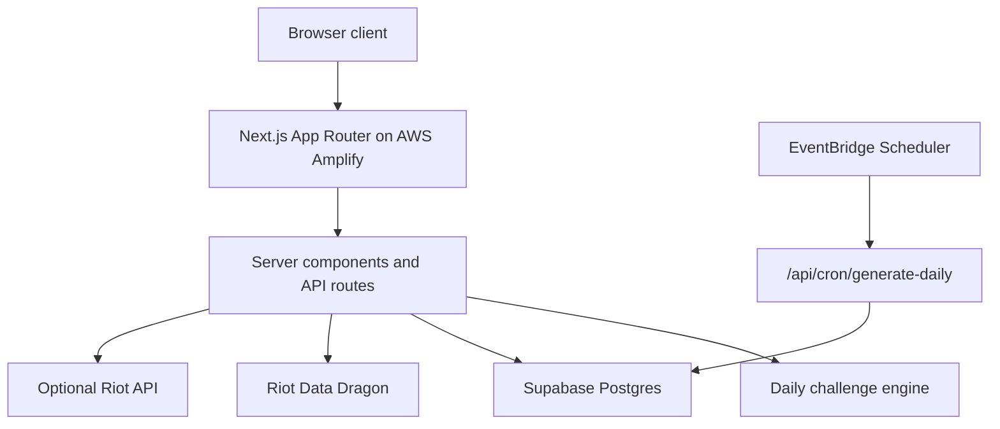

# Architecture

## Runtime Flow

1. `/api/challenges/daily` gets the latest Riot Data Dragon version.
2. The challenge engine builds deterministic UTC daily puzzles from `CHALLENGE_SALT`.
3. Item, recipe, Elo, Dodge/Queue, and Trainer modes use the generated Riot champion/item catalog.
4. Recipe, Elo, and Dodge/Queue support infinite play with per-user streak and personal-best tracking in the browser.
5. Auth, stats, guesses, suggestions, and leaderboard rows persist in Supabase when `DATABASE_URL` is configured.

## Data Sources

- Riot Data Dragon: champion, item, spell, splash, square, and versioned static data.
- CommunityDragon: ranked emblem and trainer character-render assets.
- Local generated catalog: fallback champion metadata so local demo mode still works.

## Supabase Tables

- `users`
- `daily_challenges`
- `guesses`
- `challenge_results`
- `user_stats`
- `champions`
- `abilities`
- `item_build_attempts`
- `item_recipe_attempts`
- `guess_elo_attempts`
- `dodge_queue_attempts`
- `dodge_runs`
- `suggestions`

## Deployment Model

AWS Amplify runs the Next.js SSR app and API routes. Supabase remains the database. Riot data is fetched server-side. The app remains usable in demo mode if no database is configured, but production should set all variables in `.env.example`.

## Riot Compliance

The public footer includes the fan-project Riot disclaimer. The app uses static data/assets and does not require player-specific private match data.
