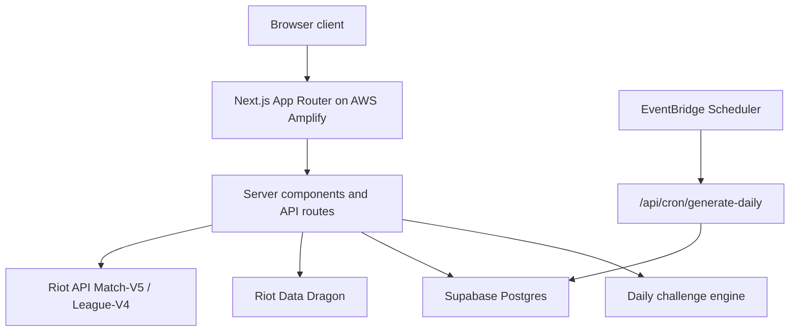

# Architecture

## Runtime Flow

1. `/api/challenges/daily` gets the latest Riot Data Dragon version.
2. The challenge engine builds deterministic UTC daily puzzles from `CHALLENGE_SALT`.
3. Item and recipe modes use live Riot Data Dragon champion/item/spell data hydrated server-side.
4. Build mode displays champion winrate stats only when they can be derived from verified Riot Match-V5 ranked solo sample outcomes.
5. Guess the Elo and Dodge/Queue use Riot League-V4 source players plus Match-V5 ranked solo matches. A round is accepted only when Match-V5 provides five lane positions per team and exactly one Smite jungler on each team.
6. Build, Recipe, Elo, and Dodge/Queue support infinite play with per-user streak and personal-best tracking in the browser.
7. Auth, stats, guesses, suggestions, and leaderboard rows persist in Supabase when `DATABASE_URL` is configured.

## Data Sources

- Riot Data Dragon: champion, item, spell, splash, square, and versioned static data.
- Riot Match-V5: `teamPosition`, `summoner1Id`, `summoner2Id`, bans, team outcome, match ID, queue, and game version for ranked lobby rounds.
- Riot League-V4: ranked source tier for Guess the Elo answer buckets.
- CommunityDragon: ranked emblem and trainer character-render assets.
- Bundled Riot-derived catalog: fallback metadata only if Data Dragon is temporarily unreachable.

## Supabase Tables

- `users`
- `daily_challenges`
- `guesses`
- `challenge_results`
- `user_stats`
- `champions`
- `abilities`
- `item_build_attempts`
- `item_recipe_attempts`
- `guess_elo_attempts`
- `dodge_queue_attempts`
- `dodge_runs`
- `suggestions`

## Deployment Model

AWS Amplify runs the Next.js SSR app and API routes. Supabase remains the database. Riot data is fetched server-side. Without `DATABASE_URL`, gameplay still loads Riot Data Dragon catalog puzzles, but accounts, saved stats, and leaderboards are disabled. Without `RIOT_API_KEY`, Match-V5 backed Elo/Lobby modes show a verified-data configuration notice instead of generated lane or spell data.

## Riot Compliance

The public footer includes the fan-project Riot disclaimer. Match-backed modes use public Riot API match and ranked endpoints server-side; PUUIDs and summoner identities are not displayed in the UI.
